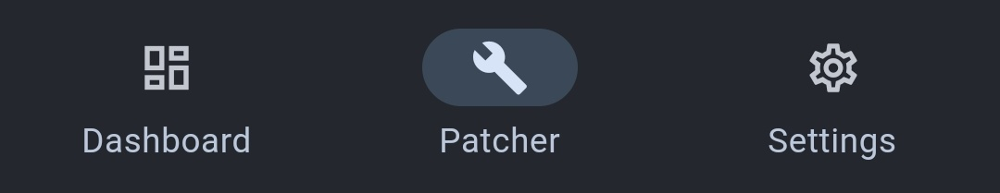

# 🔧 How Do I Patch w/ ReVanced?


This page assumes you already have [**ReVanced Manager**](installing-revanced-manager.md) installed.&#x20;


**Select the app you'd like to patch:**

* Do this by tapping the "Patcher" button on the bottom bar of the app.

<figure><figcaption></figcaption></figure>

* Then tap "Select an application"&#x20;
* Tap the app you want to modify
  * Make sure that the version listed under "Current" matches the version listed next to "Suggested" or your patches might not apply correctly, or at all. Keep in mind some apps may say "any", in which case your current version doesn't matter.
    * <mark style="color:yellow;">If your version doesn't match, go to the guide for the app you want to patch by tapping it's name here:</mark>\
      [**YouTube**](patching-youtube-w-revanced.md) **•** [**YouTube Music**](patching-yt-music-w-revanced.md)&#x20;
* Tap "Select patches"
* Tap "Recommended" under the search bar&#x20;
* Tap the "Done" button in the lower right&#x20;
* Tap the "Patch" button in the lower right&#x20;
* Wait for the app to patch, tapping "Install" when prompted
* If a Google Play Protect prompt appears, tap "Install Anyway"


You've successfully patched your app!&#x20;



If you're having issues with your patched YouTube or YouTube Music apps, you may need to install a utility app called Vanced MicroG. You can download the APK [**here**](https://github.com/TeamVanced/VancedMicroG/releases/download/v0.2.24.220220-220220001/microg.apk).

