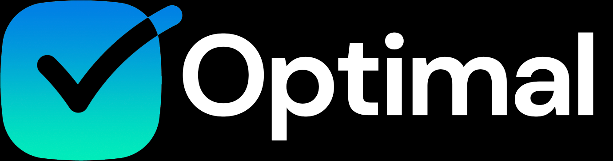

# 📖 Optimal History

Table of Contents

[Vision](optimal-history.md#vision)

[Gabe's App Hacks ](optimal-history.md#gabes-app-hacks)

[The First Apps ](optimal-history.md#the-first-apps)

[Moving from Wix to Carrd](optimal-history.md#moving-from-wix-to-carrd)

[Legal Issues on Carrd & the Birth of Optimal ](optimal-history.md#legal-issues-on-carrd-and-the-birth-of-optimal)

[Temporary End of Life](optimal-history.md#temporary-end-of-life)

[Moving Forward - v7.0](optimal-history.md#moving-forward-v7.0)

[Business as Usual - v8.0 and v9.0](optimal-history.md#business-as-usual-v8.0-and-v9.0)

[Real Progress - v10.0 and Readymag](optimal-history.md#real-progress-v10.0-and-readymag)

## Vision

Optimal began as a simple hobbyist website project developed by Gabe Fletcher. It was primarily aimed towards high school students who were either unwilling to or whose parents refused to pay for the popular Spotify Premium service.&#x20;

At the time, Gabe used the popular Spotify++ patch set for Android devices which allows users to utilize Spotify Premium features without actually paying for a Premium subscription.&#x20;

## Gabe's App Hacks

As Gabe's knowledge of the Spotify++ patch set expanded, along with modded Android apps in general, he decided to develop a website named Gabe's App Hacks (GAH).

GAH was based on the Wix website builder for about a year and a half. It featured a system that automatically detected if a user connected via a device other than a phone and would not allow them access, displaying a message telling them to either come back on a mobile device or request the desktop version of the site and hold their device horizontally.&#x20;

<figure><figcaption>
The last updated splash screen for GAH, dated October 18th, 2020 The last version string was v7.0.1-ammFX
</figcaption></figure>

## The First Apps

### Spotify++ Blue Edition

This was a special fork of the pre-exisitng Spotify++ patch for Android that was then modified further by Gabe to replace all "Spotify Green" elements of the app with a blue color, including the homescreen icon itself. This was done as an experiment in order to quickly be able to see who was using GAH in a conspicuous way.&#x20;

### Xtra for Twitch

Xtra for Twitch was a custom made Twitch client that offered adblocking. Not many reliable modified versions of vanilla Twitch existed at the time, so Xtra was a good option for GAH. It was available directly on Google Play, unlike the other apps on GAH at the time which would never be allowed there. Unfortunately, it has since been [DMCA](https://www.copyright.gov/dmca/)'d because of Twitch making terms of service changes that outlawed apps like Xtra.&#x20;

### Vanced Manager

Vanced Manager was a distribution tool for a modified YouTube client called YouTube Vanced. It's name is based on wordplay - it could easily be called YouTube Advanced, but there are no ads, thus YouTube Vanced. It quickly became a very popular YouTube mod for Android due to its total adblocking capability, inclusion of an OLED compatible dark mode, and a feature called SponsorBlock - which could algorithmically detect segments in videos that featured sponsored content and skip them - that was added near the end of its support. Much like Xtra, YouTube Vanced and Vanced Manager both faced legal issues that caused their development teams to stop work on their apps and cease distribution. In the case of YouTube Vanced, Google utilized the DMCA on the count of Vanced Manager downloading and installing apps to the user's device that were pre-modified, thus distributing a modified version of copyrighted material and violating YouTube's ToS. Another issue was the development team not properly utilizing trademark symbols when referring to YouTube Vanced on their site, and using the likeness of the YouTube logo (albeit tweaked) being too similar in Google's eyes.&#x20;

### TAP-H for Terraria&#x20;

TAP-H is the most unique app that was featured on GAH because it was the only one actively created and maintained by Gabe. TAP-H stood for "Terraria Android Paid Hack." It was a custom version of legacy Terraria for Android that was modified to have its Google Play license check removed via an app called [Lucky Patcher](https://github.com/AndroidAppz/LuckyPatcher#lucky-patcher-by-chelpus--) made by Chelpus and forked code from 5play.ru. This was most significant because other modded versions of Terraria at the time required users to manually install an OBB license file within their device's file structure. This was not a viable option for GAH because not all Android manufacturers allow users to access where OBB files must be placed. With the license checking code removed altogether, no OBB was necessary, and TAP-H could be installed and ran normally just like other apps on GAH.

<figure><figcaption>
The TAP-H download screen as it appeared on GAH
</figcaption></figure>

TAP-H became quickly deprecated when newer versions of Terraria were released by Re-logic with stricter fixes in place for modifications, making porting TAP-H to these newer versions much harder than it was to develop in the first place. Today, Optimal uses an outsourced Terraria mod that accomplishes the same things as TAP-H but with a much newer build (from 1.3 on GAH to 1.4 on Optimal).&#x20;

## Moving from Wix to Carrd

Eventually, after 7 major updates to GAH, the decision was made to move the site from Wix to the Carrd site engine for v8.0, due to its much better mobile site builder and renderer. What was so limiting about Wix is its inaccurate mobile renderer that often caused site elements to rearrange improperly during early testing of GAH. Although Wix's mobile renderer is has improved a lot since then, GAH was rendered entirely using Wix's desktop engine rather than its mobile engine, causing less than desirable load times. The need to have to turn one's device horizontally also posed issues.&#x20;

## Legal Issues on Carrd & the Birth of Optimal

GAH did not have a very significant time on the Carrd platform as it was in its first iteration because Carrd's legal team did not enjoy the usage of the word "Hack" in the naming and branding of the site. While 3 out of 4 apps on the site were outsourced from other independent developers, and no "hacking" as it is traditionally known was being done, Carrd demanded that the branding be changed. This is how the Optimal brand was eventually born.&#x20;

All of the GAH branding was removed and replaced with an early version of the Optimal brand that we know today. As an added measure to protect against further legal issues, the Spotify++ Blue Edition mod was removed from the site and replaced with an outsourced mod like every other mod on the site - at this point sourced from APKFolks.&#x20;

## Optimal Branding: v1.0 to v6.0

<figure><figcaption>
A variation of the first Optimal logo.
</figcaption></figure>

<figure><figcaption>
The Optimal logo used for v3.0 - v4.0
</figcaption></figure>

<figure><figcaption>
The Optimal logo used for v5.0 - v6.0
</figcaption></figure>

## Temporary End of Life

With the release of a very experimental v6.0 release on Carrd, Optimal had a dramatic UI change that became hard to maintain and often broke when under certain conditions, leading back to the same problems that GAH had on Wix. Inconsistencies in how Carrd manages sizing elements between its desktop and mobile renderer led Optimal to go into a temporary end of life period where the site would be fully reformatted for a v7.0 release.&#x20;

### The End of Life Message on Optimal after v6.0:

<figure><figcaption></figcaption></figure>

## Moving Forward - v7.0

v7.0 was released about 3 months after the v6.0 end of life period. It featured a completely reformatted UI and began preliminary steps to be able to integrate full iOS support via AltStore and AltServer by Riley Testut.&#x20;

<figure><figcaption></figcaption></figure>

## Business As Usual - v8.0 and v9.0

v8.0 and v9.0 didn't see nearly as much critical additions to the site as previous major additions did. They mainly worked on refining the new UI introduced in v7.0 and added several apps to the lineup for iOS.&#x20;

## Real Progress - v10.0 and Readymag

Optimal now resides on the Readymag website platform. Once again, as GAH reached a point where seemingly no meaningful additions could be added with Wix, the same happened with Optimal as it was on Carrd.&#x20;

Optimal now uses the dub.sh link shortening service rather than bit.ly because it gives a much more advanced feature set with the important feature of editing a link's target after it has been made, which has never been possible with bit.ly. This allows for Optimal to have a much more unified set of dub.sh links as compared to its bit.ly links.&#x20;

UI elements on Readymag can be much more complex and appealing than on Carrd or Wix and this greatly changes the user experience of Optimal.&#x20;

